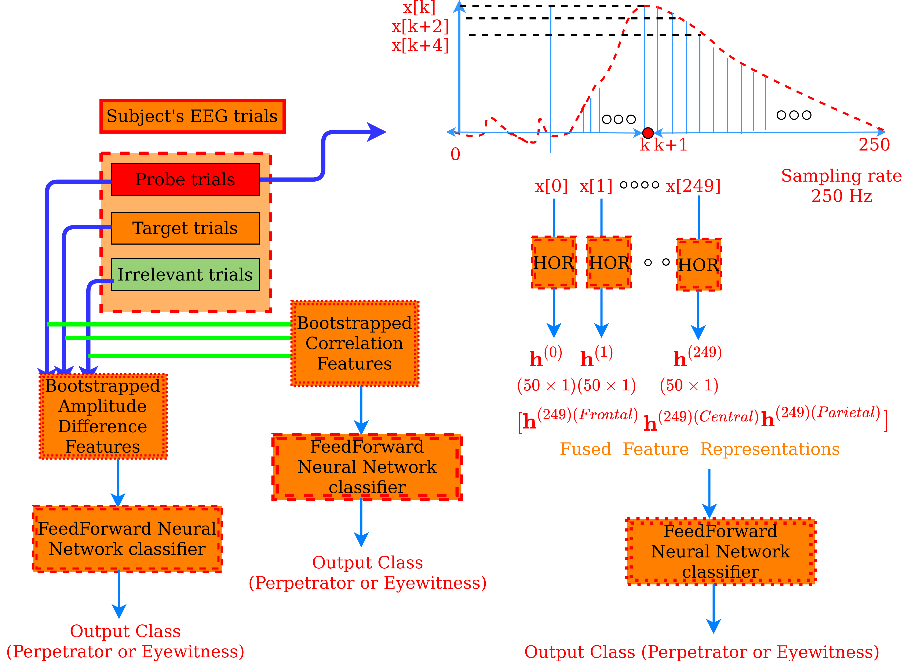
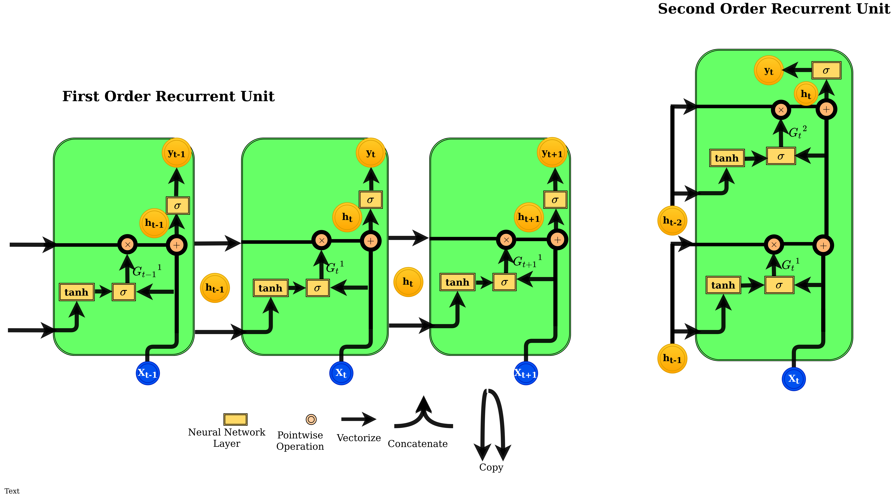

# Thou shalt not steal: Countering crimes with an EEG P300 BCI using Higher-Order Gated Recurrent Neural Networks (HOR)
P300 brain wave (event-related potential) is used as a sign of recognition of concealed information for forensic use: such as in crimes, including prevention of criminal acts. This is a machine learning classifier that successfully distinguishes between perpetrator and eyewitness. We use a novel recurrent neural network architecture called Higher Order Gated Recurrent neural networks (HOR) for compact representations of the EEG signatures.

<figure>
  <figcaption>Overall Method</figcaption>
  
</figure>
# Installation and Dependencies
In order to run this code you need to install the following modules:

Numpy and Scipy (http://www.scipy.org/install.html)

Scikit-Learn (http://scikit-learn.org/stable/install.html)

Pytorch (https://pytorch.org/get-started/locally/)

Keras (https://keras.io/getting_started)

<figure>
  <figcaption>Architecture of HOR</figcaption>
  
</figure>

# How to use:
1. 'HOR_first_order_features.py' will give the first order HOR features for the data.
2. 'HOR_second_order_features.py' will give the second order HOR features for the data.
3. 'RNN_features.py' and 'LSTM_features.py' will give the classical RNN and LSTM features respectively.
4. 'Classification_BAD.py' is for classifying the BAD features
5. 'Classification_BC_AD.py' is for classifying the BC_AD features
6. 'Classification_HOR.py' is for classifying the HOR features into a Perpetrator and Eyewitness both probe-wise as well as subject-wise. The Accuracies, Sensitivities and Specificities will be calculated.

